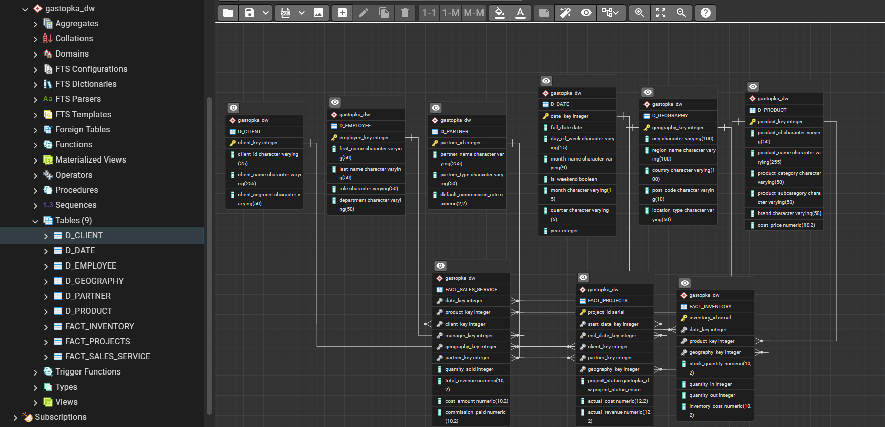
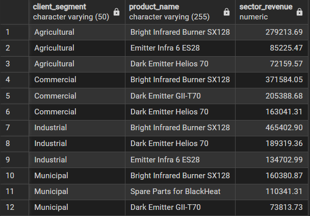

# 🔥 Gastopka Analytics: Sales & Logistics Optimization Case Study


## 📌 About the Project
Short preface: This is my portfolio for a Junior Data Analyst position. Its unique value lies in the opportunity I had to analyze real data from an actual company. It wasn't a freelance gig - the company belongs to my father and its core team recently grew to 4 employees. The company is only 3 years old and has just established its position in the gas infrared equipment market, showing stable and steady growth.

I took the initiative to organize the data for analyzing the company's latest (and most successful) year. This was followed by extensive ETL work because data systematization was far from "ideal." Next came the SQL phase, which delivered the first results, and I am closing the entire process by building interactive reports in Power BI.

[](https://gastopka.ru/)

## 🎯Project Objectives
The goal is to address a specific business requirement: the strategic expansion of warehouse space in the South. Currently, the company operates a single warehouse in the North of a city, where space constraints are partly caused by items just gathering dust. My task is to:

* **Segmentation and Preferences:** Identify the prevalent types of businesses in the South (e.g., agricultural, industrial) and map their purchasing behavior across all regions.
* **Smart Stock:** Based on these preferences, filter out the absolute top-selling models that will exclusively populate the new warehouse.
* **Financial Optimization:** Calculate the actual savings from placing a bulk wholesale order for these top models directly with the manufacturer, and quantify the reduction in logistics costs.
* **Applied Metrics:** The entire decision-making process for the expansion is built on exact numbers. To achieve this, I utilize metrics such as **CR** (Conversion Rate), **AOV** (Average Order Value), **Sales Cycle Length**, **Lost Opportunity Cost** (CAC proxy), the **Pareto Principle (80/20)** for inventory optimization, **Gaussian distribution** to understand revenue spread, and **p-value** to statistically verify demand hypotheses.
---

## 🛑 Problems 

* **Fragmented Data:** Records were scattered across CSV files and Excel sheets. Cross-analyzing sales, inventory, and projects was impossible.

* **"Dead Stock" Accumulation:** Purchasing was based on intuition. The Northern warehouse was filled with slow-moving items gathering dust, taking up valuable space.

* **Zero Metric Tracking:** There was no tracking of the Sales Funnel, Average Order Value, or the financial impact of deals lost due to long delivery times to the South (Lost Opportunity Cost).

---

## 📋 Methodology


#### 1. Extract, clean, and transform scattered CSV and Excel data into a centralized relational database (Galaxy Schema) using PostgreSQL.

#### 2. Build an interactive dashboard in Power BI to track regional sales performance, monitor the B2B sales funnel, and visualize key metrics like CR and AOV.

#### 3. Conduct advanced analysis using DAX formulas to identify the "Smart Stock" (Pareto 80/20 rule), simulate wholesale discount savings, and calculate logistics efficiency for the new Southern hub.

---
## 🛠️ Skills & Technologies Used

* **SQL (PostgreSQL):** Galaxy Schema design, Relational data modeling, CTEs, Joins, DDL/DML, Aggregate functions.
* **Power BI:** DAX (advanced measures, CALCULATE, TOPN, Variables), Data Modeling, "What-If" parameters, Interactive data visualization.
* **Python (Anaconda):** Pandas, Data extraction, cleaning, and transformation.
* **Data Analysis & Statistics:** Pareto Principle (80/20 rule), Descriptive statistics (Gaussian distribution), Hypothesis testing (T-test, p-value), B2B Sales Funnel analysis, Unit Economics (CR, AOV, LOC).

---
## 🛠️ Data Modeling & SQL (PostgreSQL)

I implemented a **Galaxy Schema**. This structure connects three primary fact tables through shared dimensions (Time, Geography, Clients, etc.).

The database naturally maps the entire customer journey: from the initial inquiry (`FACT_PROJECTS`), through the successful transaction (`FACT_SALES_SERVICE`), to the physical movement of goods (`FACT_INVENTORY`).



<details>
  <summary><b>View SQL: Data Modeling & FKeys Connection</b></summary>
  
```sql
-- Cleaning "empty keys" before establishing strict relationships (protecting against dirty 1C/CSV data)
-- Example for geography dimension
UPDATE "FACT_SALES_SERVICE"
SET geography_key = (SELECT geography_key FROM "D_GEOGRAPHY" LIMIT 1)
WHERE geography_key NOT IN (SELECT geography_key FROM "D_GEOGRAPHY");

-- Building the Galaxy Schema architecture
ALTER TABLE "FACT_SALES_SERVICE"
ADD CONSTRAINT fk_sales_date FOREIGN KEY (date_key) REFERENCES "D_DATE" (date_key),
ADD CONSTRAINT fk_sales_product FOREIGN KEY (product_key) REFERENCES "D_PRODUCT" (product_key),
ADD CONSTRAINT fk_sales_client FOREIGN KEY (client_key) REFERENCES "D_CLIENT" (client_key),
ADD CONSTRAINT fk_sales_manager FOREIGN KEY (manager_key) REFERENCES "D_MANAGER" (manager_key),
ADD CONSTRAINT fk_sales_geography FOREIGN KEY (geography_key) REFERENCES "D_GEOGRAPHY" (geography_key),
ADD CONSTRAINT fk_sales_partner FOREIGN KEY (partner_key) REFERENCES "D_PARTNER" (partner_key);
```
</details>
<details>
  <summary><b>View SQL: Market Segmentation & Top 3 Products (Southern Region)</b></summary>
  
```sql
-- Top 3 products for each business segment in the South to define the "Smart Stock"
WITH RankedProducts AS (
    SELECT 
        c.client_segment,
        p.product_name,
        SUM(s.total_revenue) AS sector_revenue,
        ROW_NUMBER() OVER(PARTITION BY c.client_segment ORDER BY SUM(s.total_revenue) DESC) as product_rank
    FROM "FACT_SALES_SERVICE" s
    JOIN "D_CLIENT" c ON s.client_key = c.client_key
    JOIN "D_PRODUCT" p ON s.product_key = p.product_key
    JOIN "D_GEOGRAPHY" g ON s.geography_key = g.geography_key
    WHERE g.region = 'South'
    GROUP BY c.client_segment, p.product_name
)
SELECT 
    client_segment,
    product_name,
    sector_revenue
FROM RankedProducts
WHERE product_rank <= 3;
```
</details>

---
🚀 SQL Result
SQL transformed raw data into a structured Galaxy Schema. PostgreSQL was used for data cleaning (orphan keys), joining tables, and ranking products. This ensures a single source of truth for the BI layer.

Below is the query output for the Top 3 "Smart Stock" models by segment in the Southern region:


---

## 📷 Dashboard Screenshots

### Executive Overview


### Product Matrix


### Regional Analysis


---
*Note: Client names and specific financial figures have been anonymized for privacy.*
