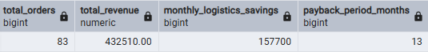
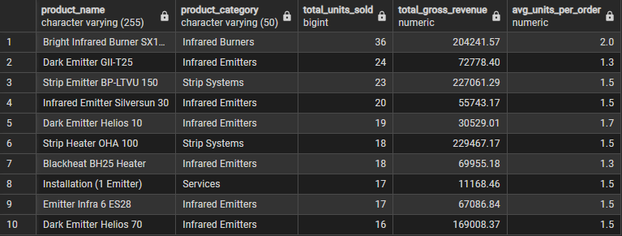

# 🔥 Gastopka Analytics: Optimalizace prodeje a logistiky pro rodinný podnik


## 📌 O projektu
Krátká předmluva: toto je pouze mé portfolio pro pozici Junior Data Analyst. Jeho zvláštnost spočívá v poskytnuté mi příležitosti analyzovat reálná data vzatá z reálné firmy. Nebyl to freelance, protože firma patří mému otci a počet jejích kmenových zaměstnanců se nedávno zvýšil na 4. Jsou jí teprve 3 roky, na trhu s plynovým infračerveným vybavením se teprve upevnila, ale vykazuje stabilní plynulý růst.

Protože jsem projevil iniciativu k uspořádání dat pro analýzu posledního, a nejúspěšnějšího, roku firmy, tak jsem si úkoly zčásti vymýšlel sám a zčásti dostával dotazy od zaměstnanců. To byla i moje první úloha – najít slabá místa, zákonitosti, predispozice. Poté byla provedena velká ETL práce, protože, jak se v malých firmách nezřídka stává, nesystematizují data „ideálně“. Potom přišlo na řadu SQL, které ukázalo první výsledky. Celý proces uzavírám tvorbou interaktivních reportů v Power BI.

[](https://gastopka.ru/)

## 🎯 Můj cíl
V tomto projektu sleduji dva cíle. Prvním je pro mě, jakožto začínajícího analytika, získání praxe s reálnými daty a také s prezentací výsledků technickým specialistům i manažerovi.

Druhým cílem je pak konkrétní požadavek firmy na rozšíření skladových prostor pro uskladnění vybavení. Aktuálně má firma jediný sklad na severu velkého města. Mým úkolem je prozkoumat podíl zákazníků z jižní části a sestavit seznam nejprodávanějších modelů ohřívačů. Jde o to, že v prvním skladu nedostatek místa způsobují i položky, na které se jen práší, a firma se chce podobnému scénáři u druhého skladu vyhnout.

---

## 🛑 Problémy 

* **„Špinavá“ data a časově náročné ETL:**
    * Data nebyla od začátku připravena pro analýzu.
    * Největší část práce (a času) zabral proces **ETL (čištění a transformace)**, aby bylo možné SQL dotazy spouštět nad validními fakty.

* **Absence segmentace:**
    * Firma sice tušila, že jih má potenciál, ale chyběly tvrdé důkazy.
    * Bylo nutné pomocí SQL vypreparovat fakta o prodejích, identifikovat top produkty a vypočítat reálný tržní podíl jižních zákazníků oproti severu.

* **Hrozba neefektivního skladu:**
    * Centrální sklad je zaplněn položkami, které se téměř neprodávají a blokují místo.
    * Pro expanzi na jih je kritické uplatnit strategii **„Chytrého skladu“**, aby se nové prostory neproměnily v odkladiště prachu.

---

## 🛠️ Tech Stack & Workflow

### 1. Čištění a transformace (Power Query & Python)
* **Power Query:** Prvotní vrstva pro sjednocení datových typů a filtraci surových exportů z 1C.
* **Python (Anaconda):** Automatizace rutinní práce. Vytvořil jsem skript pro generování dimenzionální tabulky `D_DATE`, což zrychlilo přípravu celého modelu.
* **Příprava dat (ETL):** Před nahráním do pgAdmin 4 jsem musel sjednotit všechny CSV soubory, které měly odlišnou strukturu - někde se lišily názvy sloupců (třeba „Datum“ vs. „Date“), jinde byly odlišné formáty dat nebo čísel. Vše jsem upravil do jednoho standardu, aby import proběhl bez chyb a analýza vycházela z přesných a porovnatelných údajů.

### 2. Datové modelování (PostgreSQL)
* **Architektura:** Implementace hvězdicové schémy se sdílenými dimenzemi pro vysoký výkon dotazů.
* **Validace:** SQL dotazy pro ověření integrity dat a skladových zásob před vizualizací.

### 3. Business Intelligence (Power BI)
* **DAX:** Výpočet komplexních metrik jako **Year-over-Year (YoY) Growth** a **Profit Margin**.
* **UI/UX:** Návrh intuitivního dashboardu pro okamžitý přehled o regionální poptávce a ziskovosti.

---
## 🛠️ Datové modelování a SQL analýza (PostgreSQL)

Získaná a vyčištěná data jsem importoval do předem připravených tabulek. Vztahy mezi nimi tvoří architekturu tzv. Galaxy Schema. 

Tento přístup mi umožnil propojit různé oblasti podnikání (prodeje, sklad, projekty) přes sdílené dimenze a vytvořit základ pro reporting.


### 📐 Použitá ekonomická metodika
Než jsem začal psát dotazy, definoval jsem si klíčové metriky pro vyhodnocení efektivity skladu. Aby měla čísla v reportech reálnou váhu, opíral jsem se o tyto vzorce:

* **Doba návratnosti (Payback Period):**
    $$PP = \frac{\text{Počáteční investice}}{\text{Měsíční úspora na logistice} - \text{Měsíční provozní náklady}}$$

* **Návratnost investic (ROI):**
    $$ROI = \frac{(\text{Celková úspora} - \text{Celkové náklady})}{\text{Investice}} \times 100\%$$

* **Bod zvratu:**
    $$Q_{BE} = \frac{\text{Fixní náklady skladu}}{\text{Marže na 1 objednávku}}$$

---

### 🔍 Praktické ukázky SQL dotazů

#### 1. Simulace návratnosti nového skladu
Mým hlavním úkolem bylo zjistit, jestli se firmě vyplatí otevřít sklad na jihu. Napsal jsem komplexní dotaz s využitím **CTE (Common Table Expressions)**, kde jsem porovnal náklady na současnou dopravu oproti variantě s lokálním skladem.

```sql
set search_path to gastopka_dw;


WITH Logistics_Costs as (
    SELECT
        3800 as cost_per_delivery_north_to_south,   -- náklady na současnou dopravu na jih ze skladu
        1900 as cost_per_delivery_from_south,       -- náklady na potenciální dopravu z jižního skladu
        1000000 as warehouse_setup_cost,            -- počáteční náklady na pronájem, rekonstrukci a vybavení
        84000 as monthly_op_cost                    -- měsíční nájemné a mzdové náklady na skladníka
),

Southern_Sales_Volume as (
    SELECT
        COUNT(fs.sales_id) as total_orders,
        SUM(fs.cost_amount) as total_revenue
    FROM "FACT_SALES_SERVICE" fs
    JOIN "D_GEOGRAPHY" dg ON fs.geography_key = dg.geography_key
    WHERE dg.city in ('Podolsk', 'Tula', 'Novomoskovsk', 'Skopin', 'Ryazan', 'Murom', 'Kasimov', 'Lyubertsy') -- města se zákazníky na jihu
)

-- výpočet logistických úspor (rozdíl mezi současnou a budoucí dopravou)
SELECT
    ssv.total_orders,
    ssv.total_revenue,
    ssv.total_orders * (lc.cost_per_delivery_north_to_south - lc.cost_per_delivery_from_south) as monthly_logistics_savings,
    lc.warehouse_setup_cost /
    ((ssv.total_orders * (lc.cost_per_delivery_north_to_south - lc.cost_per_delivery_from_south)) - lc.monthly_op_cost) -- vzorec pro dobu návratnosti (Payback Period)
    as payback_period_months
FROM Southern_Sales_Volume ssv, Logistics_Costs lc;
```

<p align="center">

</p>

💡 Výsledek:
Analýza ukázala, že při současném objemu objednávek (83 za sledované období) by měsíční úspora na logistice činila cca 157 700. Po odečtení provozních nákladů nám vychází doba návratnosti investice na 13 měsíců. To je pro vedení signál, že projekt je bezpečný a 
životaschopný.

---

2. Identifikace TOP produktů pro velkoobchod
Dále jsem potřeboval zjistit, které produkty tvoří základ našeho obratu a jak se nakupují. Cílem bylo vytipovat modely vhodné pro objemové slevy u dodavatelů.

```SQL
set search_path to gastopka_dw;

SELECT
    p.product_name,
    p.product_category,
    -- celkové množství prodaných kusů
    SUM(f.quantity_sold) as total_units_sold,
    -- celkové hrubé tržby za daný model
    ROUND(SUM(f.total_revenue), 2) as total_gross_revenue,
    -- průměrný počet kusů v jedné objednávce
    ROUND(AVG(f.quantity_sold), 1) as avg_units_per_order
FROM "FACT_SALES_SERVICE" f
JOIN "D_PRODUCT" p ON f.product_key = p.product_key
GROUP BY p.product_name, p.product_category
ORDER BY total_units_sold DESC
LIMIT 10;
```

<p align="center">

</p>

💡 Výsledek:
Dotaz odhalil nejen bestsellery podle tržeb, ale díky sloupci avg_units_per_order i nákupní chování. Tyto data slouží k lepšímu vyjednávání s výrobcem.

---
🚀 Závěr SQL části
V této fázi jsem úspěšně transformoval surová data do strukturované podoby a pomocí SQL ověřil klíčové business hypotézy. Máme tvrdá data, která potvrzují návratnost skladu i potenciál produktů.

Dál jsem připravená data napojil na Power BI.

---

## 📷 Dashboard Screenshots

### Executive Overview


### Product Matrix


### Regional Analysis


---
*Note: Client names and specific financial figures have been anonymized for privacy.*
